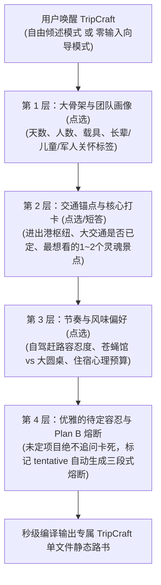

# TripCraft · 旅艺
## 智能旅行路书静态网页生成系统 · 产品设计、商业化战略与开源架构全案

> **项目名称**：TripCraft (旅艺 / 智程路书)  
> **核心定位**：人人可用的高颜值、免构建、苹果液态玻璃（Liquid Glass）旅行路书静态网页生成引擎 & 中立旅行超级中枢（Universal Travel Harness）  
> **项目作者**：个人独立开发者（秋招杀手级代表作 / GitHub 开源项目）  
> **实战基准**：西行计划·丝路自驾路书 (`trip-cts.pages.dev`, RELEASE v3.6.3)  
> **当前状态**：产品设计、商业化分层、交互规范与技术方案完整收敛（待建仓与落地开发）

---

## 目录索引 (Table of Contents)
1. [一、系统愿景与核心初心 (Vision & Core Mission)](#一系统愿景与核心初心-vision--core-mission)
2. [二、商业化战略思考：破局行业死局与双轨演进 (Commercial Strategy & B2B2C Disruption)](#二商业化战略思考破局行业死局与双轨演进-commercial-strategy--b2b2c-disruption)
   - [2.1 行业底层真相与痛点反思：低频、重线下、非标品](#21-行业底层真相与痛点反思低频重线下非标品)
   - [2.2 破局路径一：做线下从业者的“数字化外骨骼”（B2B2C 赋能模式）](#22-破局路径一做线下从业者的数字化外骨骼b2b2c-赋能模式)
   - [2.3 破局路径二：大厂插件 vs Universal Travel Harness（万物皆可 Plug-in）](#23-破局路径二大厂插件-vs-universal-travel-harness万物皆可-plug-in)
   - [2.4 破局路径三：横向技术迁移力（活动会务、研学营地与政企考察）](#24-破局路径三横向技术迁移力活动会务研学营地与政企考察)
   - [2.5 秋招面试绝杀逻辑与商业格局答辩（Interview Pitching）](#25-秋招面试绝杀逻辑与商业格局答辩interview-pitching)
3. [三、核心交互机制：渐进式反问与认知对齐引擎 (Socratic Clarification Engine)](#三核心交互机制渐进式反问与认知对齐引擎-socratic-clarification-engine)
   - [3.1 现实洞察：为什么不能指望用户一次性给全信息？](#31-现实洞察为什么不能指望用户一次性给全信息)
   - [3.2 双模唤醒机制：自由倾倒 vs 零输入向导](#32-双模唤醒机制自由倾倒-vs-零输入向导)
   - [3.3 拒绝打字疲劳：全流程胶囊药丸点选交互 (Zero-Typing Pills)](#33-拒绝打字疲劳全流程胶囊药丸点选交互-zero-typing-pills)
   - [3.4 四层渐进式收敛漏斗与待定（Tentative）容忍策略](#34-四层渐进式收敛漏斗与待定tentative容忍策略)
4. [四、目的地感知与视觉设计系统 (Destination-Aware Visual System)](#四目的地感知与视觉设计系统-destination-aware-visual-system)
   - [4.1 五大预设液态玻璃主题矩阵 (Liquid Glass Themes)](#41-五大预设液态玻璃主题矩阵-liquid-glass-themes)
   - [4.2 苹果液态玻璃（Liquid Glass）核心设计规范](#42-苹果液态玻璃liquid-glass核心设计规范)
   - [4.3 AI 文生图动态意境背景与 16:9 电影画幅 Banner 自动生成引擎](#43-ai-文生图动态意境背景与-169-电影画幅-banner-自动生成引擎)
   - [4.4 平台级富媒体可视化 POI 展卡与端内闭环生态（通义千问×淘宝模式）](#44-平台级富媒体可视化-poi-展卡与端内闭环生态通义千问淘宝模式)
5. [五、商业化价值分层：普通版 vs VIP 尊享版体系 (Standard vs VIP Tiering)](#五商业化价值分层普通版-vs-vip-尊享版体系-standard-vs-vip-tiering)
   - [5.1 通用核心底座：做大留存率与自发裂变](#51-通用核心底座做大留存率与自发裂变)
   - [5.2 维度 1：多流派顶流视觉系统（基于 Mobbin 提炼内置）](#52-维度-1多流派顶流视觉系统基于-mobbin-提炼内置)
   - [5.3 维度 2：仪式感与数字资产沉淀（旅后 AI 回忆录与足迹大片）](#53-维度-2仪式感与数字资产沉淀旅后-ai-回忆录与足迹大片)
   - [5.4 维度 3：自驾车队实时协同（多车信标雷达与 AA 账单导出）](#54-维度-3自驾车队实时协同多车信标雷达与-aa-账单导出)
   - [5.5 维度 4：行中智能守护与实时气象路况雷达](#55-维度-4行中智能守护与实时气象路况雷达)
   - [5.6 维度 5：企业级专属域名与私密密码锁](#56-维度-5企业级专属域名与私密密码锁)
6. [六、TripCraft 系统架构与技术规范 (Technical Architecture & DSL)](#六tripcraft-系统架构与技术规范-technical-architecture--dsl)
   - [6.1 技能包工程目录结构 (Monorepo Blueprint)](#61-技能包工程目录结构-monorepo-blueprint)
   - [6.2 核心数据契约：`TripCraft DSL` 规范 (JSON / YAML)](#62-核心数据契约tripcraft-dsl-规范-json--yaml)
7. [七、落地行动路线图 (Execution Roadmap)](#七落地行动路线图-execution-roadmap)

---

## 一、系统愿景与核心初心 (Vision & Core Mission)

### 1.1 痛点与行业背景
在数字化高度发达的今天，**旅行自驾出行的数字交付体验却惊人地停留在“石器时代”**：
- **C 端散客的割裂**：机票在航旅纵横、酒店在携程、门票在美团、路线在小红书、导航在高德。旅途中全家在不同 App 间狼狈切换，或只能手写凌乱的备忘录；
- **B 端从业者的尴尬**：包车车队老板、地接旅行社收取上万元服务费，最终交付给高净值客人的却是一段**丑陋的微信长文本**或**排版糟糕的 Word 截图**；
- **单文件高品质网页的极高门槛**：基于高德 JS API 2.0 的全屏联动、Apple Maps 级真实公路双层高对比导航、长辈关怀大字模式（Zero-FOUC）、三段式弹性时间熔断卡片，通常需要资深前端数千行代码的手工清洗与调试，普通人根本无法快速复现。

### 1.2 TripCraft 的使命
**TripCraft（旅艺）** 旨在打破这一切：  
**让每个人（无论是个人领队还是专业车队定制师），都能通过极简的 AI 交互，秒级编译生成一份任何人随时随地都能秒开、无任何后端依赖、视觉媲美苹果头等舱体验的专属单文件静态旅行路书 Web App。**

---

## 二、商业化战略思考：破局行业死局与双轨演进 (Commercial Strategy & B2B2C Disruption)

### 2.1 行业底层真相与痛点反思：低频、重线下、非标品
商业化思考的前提是**极度清醒的行业认知**：
1. **频次极低**：旅游不是外卖或打车，普通人长途深度游一年仅 1~2 次，单纯面向 C 端的纯工具商业天花板极低；
2. **重线下履约**：自驾与定制游极其依赖地面实体资源——考斯特能否进村、山路是否有暗冰、高反去哪里吸氧、老字号几点排队，线上算法完全无法替代线下“老司机/本地地接”的经验沉淀；
3. **平台围墙花园割裂**：OTA 各自为战（携程守机酒、美团守餐饮门票、飞猪守特惠活动），各大平台互相屏蔽，没有任何一个巨头愿意主动帮竞品整合数据。

### 2.2 破局路径一：做线下从业者的“数字化外骨骼”（B2B2C 赋能模式）
**不要试图用 AI 去消灭或颠覆线下旅行社，而要成为武装他们的超级工具！**

```
┌─────────────────────────┐               ┌─────────────────────────────────────────┐
│ 线下小 B 痛点           │               │ TripCraft B2B2C 赋能落地                │
│ • 车队/地接收取数万元    │  TripCraft    │ • 30 秒生成专属客户的苹果级路书 Web App  │
│ • 行程交付只发微信长文本 │ ────────────► │ • 客户惊艳度暴增，客单价直接提升 ¥1000+ │
│ • 客户满意度与溢价受限  │   赋能小 B    │ • 转化模式：SaaS 订阅 ¥199/月 或按单付费│
└─────────────────────────┘               └─────────────────────────────────────────┘
```
* **目标客群**：全国上万家考斯特大巴车队、精品地接社、小红书自驾独立主理人、高端私家团定制师；
* **刚需场景**：他们一年 365 天每天都在接待客人。用 TripCraft 给客户交付一个带车队专属铭牌、高德精准导航、考斯特通达性标识的路书，地接社的专业形象瞬间从“土作坊”跃升为“顶级高定管家”，他们极其乐意为此付费。

### 2.3 破局路径二：大厂插件 vs Universal Travel Harness（万物皆可 Plug-in）
在系统定位上，**坚决不做单一巨头的封闭插件，而是打造独立中立的 Universal Travel Harness**：

| 评估维度 | 方案 A：单一巨头内嵌插件 (如 Ctrip Feature) | 方案 B (TripCraft)：Universal Travel Harness (旅行超级中枢) |
| :--- | :--- | :--- |
| **产品本质** | 巨头 App 里众多功能中的一个小标签（功能级） | **跨平台个人旅行操作系统 (Personal Travel OS / 平台级)** |
| **数据边界** | 仅限本集团内部数据（机酒自闭环，无法跨平台） | **全网汇聚**（用户自主授权携程、美团、飞猪、航旅纵横、小红书等） |
| **商业模式** | 仅靠微薄的平台内部分润或 KPI 绩效 | **多元超级造血引擎**（CPS 跨平台分销返佣 + VIP 订阅 + 插件市场） |
| **用户心智** | “这是携程的一个页面” | **“这是我所有旅行资产的终极指挥中枢”**（极高粘性与不可替代性） |
| **商业估值** | 几百万内部项目预算 | **百亿美元级中立超级入口**（类似旅行界的 Zapier / TripIt + Figma） |

* **超级商业飞轮：全网 CPS 自动比价分销（Affiliate Revenue）**：
  * 当路书中发现某天缺少门票或酒店时，Harness 自动调用已授权的飞猪、携程、美团插件比价；
  * 用户点击富媒体卡片跳转购买，**TripCraft 直接从 OTA 赚取 3%~8% 的 CPS 分销佣金**，实现无货源、重流量转化的暴利闭环。

### 2.4 破局路径三：横向技术迁移力（超越旅游的时空流动通用底座）
这套“免构建单文件 + 液态玻璃 UI + 空间 GIS 拟合 + 人机渐进式对齐”的全套架构，天然可以横向迁移至其他**高客单、高频次的企业级线下场景**：
1. **高端研学营地与名校研学路线手册**；
2. **企业千人年会、出海会务（MICE 市场）动线系统**；
3. **政府招商引资与商务考察私密行程卡**；
4. **越野跑、骑行穿越与户外赛事保障雷达**。

### 2.5 秋招面试绝杀逻辑与商业格局答辩（Interview Pitching）
在面对大厂（携程、美团、飞猪）总监级面试官挑战“旅游低频且重线下”时，可祭出经典的三部曲话术：
> 1. **承认现实，展现清醒**：“面试官您非常内行。旅游确实具有‘低频、重线下、非标品、极其依赖本地履约’的现实属性。如果把它定位为单纯让散客一年用一次的 C 端工具，天花板确实受限。”
> 2. **供给侧破局（B2B2C 视角）**：“所以我对 TripCraft 的商业切入点并不是颠覆线下，而是**成为线下旅行社、考斯特车队和定制师的‘数字化外骨骼’**。全国有上万家定制车队每天在服务高净值客户，却只能靠微信发 Word 截图。他们才是最高频、最愿意为这套高颜值交付物买单的付费方。”
> 3. **平台级连接价值**：“而对于携程或美团这种大平台，这套工具是**穿透线下履约黑盒的最佳抓手**——通过给线下车队和导游提供好用的路书引擎，平台顺理成章地把线下散碎的餐饮、二次门票、特产消费，通过富媒体卡片重新收编回平台的线上交易闭环中。”

---

## 三、核心交互机制：渐进式反问与认知对齐引擎 (Socratic Clarification Engine)

### 3.1 现实洞察：为什么不能指望用户一次性给全信息？
真实用户在计划旅行时，**绝大部分信息处于“未确定”或“模糊”状态**：
- 机票/高铁还没抢到或正在比价，出发时间浮动；
- 知道想去大理和丽江，但具体每天住哪全然未知；
- 吃饭通常是随缘，但同行可能有老人小孩不能吃辣、长辈偏好热食；
- 领队开考斯特大巴，很多狭窄小巷和野景点根本无法进出。

**若 Skill 要求用户填写严格枯燥的表单，用户会直接流失；若 LLM 自行胡乱脑补，又会产生灾难性的旅游路线幻觉。**

---

### 3.2 双模唤醒机制 (Dual-Mode Onboarding)
在启动生成前，TripCraft 为用户提供两条极其友好的输入路径：

```text
┌─────────────────────────────────────────────────────────────────────────────┐
│ 模式 A：自由倾倒模式 (Free Dump Mode)                                         │
│ 适合：手里已有备忘录碎片、小红书攻略截图识别文字、或心中有大致想法的用户      │
│ 提示语：“你可以直接用一段大白话，畅所欲言告诉我你想去哪、大概玩几天、同行有谁、 │
│ 喜欢吃什么或任何在意的细节（甚至直接粘贴朋友的微信聊天记录）。剩下的交给我！” │
└─────────────────────────────────────────────────────────────────────────────┘
                                      OR
┌─────────────────────────────────────────────────────────────────────────────┐
│ 模式 B：零输入向导模式 (Zero-Effort Guided Wizard)                           │
│ 适合：“我脑子一片空白，你直接问我吧”的用户                                    │
│ 提示语：“没问题！我们只需简单点选几个选项，不到 1 分钟就能为您生成专属路书：”   │
└─────────────────────────────────────────────────────────────────────────────┘
```

---

### 3.3 拒绝打字疲劳：全流程胶囊药丸点选交互 (Zero-Typing Pills)
传统 AI 对话工具最大的体验硬伤在于**“逼着用户不停手打长文本”**。  
TripCraft 坚持**“选项优先、轻点即选（One-Tap Pills）”**的极简交互原则，将常见旅行参数全量胶囊化：

```text
1. 【旅行天数】：
   [ 3~4天 · 周末轻假 ]  [ 5~6天 · 黄金经典 ]  [ 7~9天 · 全景大环线 ]  [ 10天+ · 旷野深度漫游 ]

2. 【出行阵容】：
   [ 独自探索 🚶 ]  [ 2人情侣/闺蜜 👫 ]  [ 3~5人温馨家庭 👨‍👩‍👧 ]  [ 6~10+人车队包车 🚌 ]

3. 【团队专属关怀 (可多选)】：
   [ 👓 有50+长辈 (一键激活大字关怀模式) ]    [ 👶 有婴幼童同行 (节奏放缓/多停靠) ]
   [ 🎖️ 有退役/现役军人 (注入免门票手册) ]   [ 🐾 携宠自驾友好 ]

4. 【出行载具】：
   [ 🚗 普通轿车/城市SUV ]  [ 🚙 硬派越野/四驱 ]  [ 🚌 丰田考斯特/中巴 ]  [ 🚄 高铁+落地租车 ]

5. 【行进节奏】：
   [ 🦥 睡到自然醒 · 松弛度假 ]  [ ⚖️ 充实平衡 · 经典必打卡 ]  [ ⚡ 极限特种兵 · 全景不留遗憾 ]

6. 【风味偏好】：
   [ 🥢 街头老字号/市井苍蝇馆 ]  [ 🥘 宽敞舒适大包间/特色正餐 ]  [ 🌶️ 嗜辣如命 ]  [ 🍲 清淡温润暖胃 ]
```
> **跨端体验**：在移动 Web 端以磨砂玻璃药丸呈现，一指轻触即中；在命令行/终端中回复 `1C, 2D, 3A` 即可秒级收敛，彻底杜绝打字心累。

---

### 3.4 四层渐进式收敛漏斗与待定（Tentative）容忍策略



- **核心原则**：凡是用户回复“还没定”、“看着办”、“随便”的项目，系统**绝不反复追问**，而是自动注入行业最佳实践并打上语义标记：
  - 酒店：`建议住宿标准（待定）：星级标准/特色民宿`（自动挂载高德一键导航与周边指南）；
  - 交通：`参考航班/车次（建议上午 10:00 前抵达）`；
  - 餐饮：`推荐本地口碑前 3 名（可到店后举手表决）`；
  - 关键节点：`🟢 计划A ｜ 🟡 弹性缓冲 ｜ 🔴 降级预案`（三段式时间熔断）。

---

## 四、目的地感知与视觉设计系统 (Destination-Aware Visual System)

### 4.1 五大预设液态玻璃主题矩阵 (Liquid Glass Themes)
内置**「目的地语义嗅探器」**，根据地名地貌自动为网页换装，并赋予专属高斯模糊流光：

```
[ 🏜️ 丝路大漠金 ]     [ ⚡ 电光公路蓝 ]     [ 🏔️ 高原松石青 ]     [ 🍵 江南烟雨翠 ]     [ ❄️ 极境极光银 ]
 琥珀金 + 赭石深褐     电光天蓝 + 晶石黑     松石绿 + 藏青蓝      碧波冷翠 + 素宣白     极夜冰蓝 + 雾银
 (丝路/敦煌/中东)     (公路巡航/都市夜行)   (川西/西藏/青海)     (苏杭/徽州/山水)     (长白山/北欧/冰川)
```

| 主题标识 (`themeId`) | 自动触发目的地 / 场景 | 核心主色 (`--accent-gold`) | 底色与渐变氛围 (`--bg-deep`) | 适用旅行体验与心理意象 |
| :--- | :--- | :--- | :--- | :--- |
| **`dunhuang-gold`**<br>🏜️ 丝路大漠金 | 西北大环线、敦煌、甘南、张掖、额济纳、中东自驾 | 琥珀金 `#fbbf24`<br>流光金 `#f59e0b` | 深褐 `#140d07`<br>配合飞天暗纹与暖红光晕 | 苍茫、厚重、史诗感与日落余晖 |
| **`cyber-blue`**<br>⚡ 电光公路蓝 | 独库公路、沿海一号公路、海南环岛、城市 Citywalk | 电光天蓝 `#0091ff`<br>荧光青 `#38bdf8` | 暗曜黑 `#090d16`<br>深邃星空与双层冷蓝光圈 | 科技、极简、高对比专业自驾导航 |
| **`plateau-cyan`**<br>🏔️ 高原松石青 | 川西环线、滇藏线、西藏、青海湖、新疆喀纳斯 | 湖水松石绿 `#0d9488`<br>明黄 `#eab308` | 藏青蓝 `#0b1320`<br>雪山白与经幡多彩点缀 | 圣洁、神秘、纯净的高原大自然 |
| **`jiangnan-emerald`**<br>🍵 江南烟雨翠 | 苏州、杭州、徽州宏村、婺源、武夷山、阳朔漓江 | 碧波翠绿 `#059669`<br>竹青 `#10b981` | 水墨玄黑 `#09110d`<br>素宣白文字与薄雾质感 | 雅致、温润、如水墨画般的呼吸感 |
| **`glacier-silver`**<br>❄️ 极境极光银 | 长白山、呼伦贝尔冬日、北欧、冰岛、阿勒泰粉雪 | 极光翡翠 `#34d399`<br>冰霜银 `#e2e8f0` | 极夜青灰 `#080e14`<br>冰川幽蓝冷光折射 | 冷冽、通透、纯粹的冰雪晶体质感 |

### 4.2 苹果液态玻璃（Liquid Glass）核心设计规范
1. **五层深度景深（5-Layer Stacking）**：
   - Layer 0：全屏满铺地图（浅色矢量或卫星实景自由流动）；
   - Layer 1：悬浮岛 Header 与天数切换胶囊（`backdrop-filter: blur(28px) saturate(190%)`）；
   - Layer 2：iOS 悬浮磨砂玻璃底部 Dock；
   - Layer 3：二级定制图钉微气泡（暗曜石液态玻璃）；
   - Layer 4：半屏深度攻略抽屉（顶部全透见地图，下方高透磨砂展示图文）。
2. **长辈关怀大字模式（Senior Care Mode）**：
   - 包含 `<head>` 顶端极轻量 Zero-FOUC 防闪烁逻辑；
   - 满足 WCAG 2.1 AAA 标准，交互按钮触控靶区全面扩大至 ≥ 48px × 48px；
   - 时间节点与文字采用高对比防眩光调优。
3. **CSS Grid 0fr-1fr 硬件加速手风琴折叠**：
   - 彻底避免 JS `scrollHeight` 重排（Reflow）计算，动画平滑无顿挫；
   - 180° CSS 硬件加速平滑旋转箭头。

### 4.3 AI 文生图动态意境背景与 16:9 电影画幅 Banner 自动生成引擎
* **痛点反思**：纯色背景单调呆板，缺乏自驾大片感与向往感；西行路书的成功就在于**深色大漠渐变与飞天暗纹在高斯模糊（Liquid Glass）折射下的深邃质感**；
* **Prompt 自动生成规范**：Skill 识别目的地后，自动构造专为“暗调毛玻璃衬底”定制的生图 Prompt：
  * **约束规范**：`[Destination Keyword], dark cinematic moody atmosphere, subtle vignette, low saturation in central area, deep shadows, misty ambient rim light, 4K film photography, aesthetic composition for glassmorphism overlay --ar 16:9 --no text, logos, bright white glare`；
* **双层氛围渲染**：
  1. **全局底图暗纹**：`background-image` 叠加大角度深色线性渐变遮罩，呼吸感十足且保证正文文字 WCAG 极高对比度；
  2. **每日核心打卡 Banner**：为每日核心景观（如东风航天城发射架、怪树林枯木残阳）自动配发 16:9 电影画幅的高清横幅，营造杂志级排版美感。

### 4.4 平台级富媒体可视化 POI 展卡与端内闭环生态（通义千问×淘宝模式）
* **标杆类比（通义千问 × 淘宝商品卡片模式）**：
  用户在千问比价时，聊天流内直接嵌入带**头图、实时价格、优惠券、销量、点击直跳淘宝 App 极速购买**的可视化卡片。TripCraft 在路书中支持同等规格的沉浸式商户展卡：
  ```text
  ┌─────────────────────────────────────────────────────────────┐
  │                 TripCraft 沉浸式 POI 展卡形态                 │
  │ ┌──────────────────┬──────────────────────────────────────┐ │
  │ │  [高清实景头图]  │  🥢 甘州名吃（大佛寺文化街总店）       │ │
  │ │  招牌菜品缩略图  │  ⭐️ 4.8 分 ｜ 人均 ¥58 ｜ 距酒店 150m │ │
  │ │  (AI / 大厂图库) │  🏷️ 美团必吃榜 ｜ 汉唐古风大包间      │ │
  │ │                  │  [ 📱 大众点评一键直达 ] [ 导航 ➔ ]  │ │
  │ └──────────────────┴──────────────────────────────────────┘ │
  └─────────────────────────────────────────────────────────────┘
  ```
  1. **开源端（Lightweight Fallback）**：通过 AI 自动提炼必吃特色菜与景观机位，调用开放图库生成精致微图文卡；
  2. **大厂平台级（Enterprise Supercharged）**：直接调用携程景酒图库、美团大众点评商户实拍图库，注入“黑珍珠”、“必吃榜”金牌背书，通过 Universal Link 一键调起 App 领券订座，形成**“内容种草 ➔ 行程规划 ➔ 实时履约交易”**的最短商业闭环。

---

## 五、商业化价值分层：普通版 vs VIP 尊享版体系 (Standard vs VIP Tiering)

### 5.1 通用核心底座：做大留存率与自发裂变
**核心底线**：普通版**绝不阉割核心自驾体验**，必须是一个完整、顺滑、好用的现代化路书：
1. **0 登录门槛、秒开秒查**：纯静态免构建单文件，微信/浏览器点开即用；
2. **高德地图原生双向联动**：全览枢纽防堆叠、单天单条 Apple Maps 电光蓝高光公路航线；
3. **基础长辈关怀大字模式**：包含 Zero-FOUC 防闪烁与 WCAG 48px 大触控靶区；
4. **基础团队工具**：行程打卡进度条、行前行李清单、基础公共 AA 记账器。

---

### 5.2 维度 1：多流派顶流视觉系统（基于 Mobbin 提炼内置）
普通版自动推荐单套适配的液态玻璃色系；而 VIP 版提供**跨平台、多设计流派的自由换肤引擎**。  
通过接入 **Mobbin API / Skill** 从全球顶尖 Travel & Navigation 标杆 App（Airbnb、Flighty、Apple Maps、Lonely Planet、Arc 等）提炼设计切片，内置五大高保真设计规范系统：

```text
1. 🍏 Apple Liquid Glass (苹果液态玻璃)
   • 核心规范：高透磨砂折射、28px 高斯模糊饱和度增强、多层悬浮景深、电光天蓝流光线；
   • 适用受众：追求极致科技质感、果粉审美与现代自驾体验的团队。

2. 🤖 Google Material You (谷歌动态意境流光)
   • 核心规范：基于目的地的色彩动态提取算法、柔和高对比卡片轮廓、大留白、超大圆角与温润排版；
   • 适用受众：偏好 Android 现代原生态设计、注重舒适与呼吸感的用户。

3. 🪵 Vintage Skeuomorphism (复古探索家手账 / 拟物化)
   • 核心规范：真实牛皮纸暗纹底色、黄铜复古图钉、复古火漆印章打卡徽章、探险家罗盘动效；
   • 适用受众：自驾越野爱好者、摄影发烧友、追求人文历史厚重感的旅者。

4. 📐 Swiss International Minimalist (瑞士国际主义扁平化)
   • 核心规范：严谨高密度网格系统、纯黑白灰配亮橙点缀、无衬线几何字体、极致的信息层级克制；
   • 适用受众：极简主义者、年轻徒步客、城市 Citywalk 玩家。

5. 🌌 Cyberpunk Dark HUD (赛博夜巡仪表盘)
   • 核心规范：暗黑高对比发光界面、HUD 荧光绿与电光青双色航线、未来座舱机甲仪表盘视觉；
   • 适用受众：夜晚长途赶路、追求极客范儿与独特机车/自驾质感的用户。
```

---

### 5.3 维度 2：仪式感与数字资产沉淀（旅后 AI 回忆录与足迹大片）
* **定制专属车队铭牌与启程开屏仪式**：“张氏家族 2026 西行全记录 / 考斯特 1 号自驾车队专属定制”，专属开屏电影感过场，注入大漠风声/篝火白噪音 BGM；
* **AI 旅后摄影回忆录（Post-Trip Memory Journal）**：
  * 队员行中随时上传照片，AI 自动读取照片 GPS Exif 经纬度与时间，**精准锚定到对应天数与地图图钉上**；
  * 行程结束后，原本的“路书计划”自动蜕变为**“永久交互式回忆画卷”**，并自动生成带动态飞机/汽车轨迹的足迹视频海报，微信朋友圈直接霸屏。

---

### 5.4 维度 3：自驾车队实时协同（多车信标雷达与 AA 账单导出）
* **多车实时信标与头车雷达 (Live Beacon Radar)**：团队多辆车出行时，头车与尾车位置实时显示在地图上，相距超过 5 公里自动弹窗提醒防走散；
* **轻量全员打卡大厅**：领队在顶部进度条一眼看清谁已登车、谁已入园；
* **智能账单导出与一键收款码**：AA 记账器升级，支持分类饼状图分析、多币种换算，并可一键生成带微信群收款二维码的高清对账单长图。

---

### 5.5 维度 4：行中智能守护与实时气象路况雷达
* **实时气象与极端天气预警**：沿途城市降水、大风降温、沙尘暴实时推送；
* **路况动态熔断报警器**：监测到前方高速拥堵延误超 30 分钟时，页面顶部主动升起红色警戒条：  
  > “⚠️ 报告领队：前方连霍高速乌鞘岭隧道发生拥堵（预计延误 45 分钟）。系统已为您自动激活【Plan B：安门服务区观雪山】备选路线，点此一键重调导航 ➔”

---

### 5.6 维度 5：企业级专属域名与私密密码锁
* **独立专属 Vanity URL**：携程/飞猪大客户可获得定制专属二级域名（如 `trip.ctrip.com/vip/jyx-family-2026`）或独立顶级域名；
* **全队专属私密密码锁**：保护名人家企或高净值全家隐私，输入团队密码后方可解锁查看行程、航班号与入住房号。

---

## 六、TripCraft 系统架构与技术规范 (Technical Architecture & DSL)

### 6.1 技能包工程目录结构 (Monorepo Blueprint)

```text
TripCraft/
├── README.md                   ← 【开源门面】中英文介绍、Live Demo 截图、一键使用指南
├── package.json                ← 极简依赖（zero runtime dependencies，仅 dev 调试工具）
├── skills/                     ← 【标准 Agent Skills 目录】
│   └── tripcraft/
│       ├── SKILL.md            ← Skill 定义（含 Socratic 渐进反问 Prompt 与流程控制）
│       └── references/         ← 提示词模版与知识库
├── src/                        ← 【核心编译器与工具集】
│   ├── compiler.js             ← 单文件 HTML 编译器（将 DSL 组装注入模板）
│   ├── geo.js                  ← 高德 Web API 经纬度查询与 Driving 轨迹算路适配器
│   ├── theme.js                ← 目的地语义嗅探与 CSS 变量 Token 注入器
│   └── mobbin-parser.js        ← Mobbin 设计风格映射与 Token 转换器
├── templates/                  ← 【组件切片库】
│   ├── index.template.html     ← 网页主骨架
│   ├── themes/                 ← 5 套设计风格规范 (LiquidGlass / Material / Retro / Swiss / Cyber)
│   │   ├── apple-glass.css
│   │   ├── google-material.css
│   │   ├── vintage-retro.css
│   │   ├── swiss-minimal.css
│   │   └── cyber-hud.css
│   ├── styles/                 ← 核心排版、长辈大字模式与无重排手风琴动画
│   └── scripts/                ← 高德 2.0 引擎、防闪退保护阀、防 NaN 异常隔离
└── examples/                   ← 【标杆开箱即用案例库】
    ├── dunhuang-silkroad-9d/   ← 本项目的西行丝路 9 天标杆 (trip-cts.pages.dev)
    ├── chuanxi-ring-5d/        ← 川西松石青大环线案例
    └── jiangnan-watertown-3d/  ← 江南烟雨水乡案例
```

### 6.2 核心数据契约：`TripCraft DSL` 规范 (JSON / YAML)

```json
{
  "$schema": "https://tripcraft.dev/schema/v1.json",
  "meta": {
    "title": "西行计划 · 丝路自驾路书",
    "subtitle": "9天西北大环线 · 考斯特深度定制",
    "tier": "vip",
    "designSystem": "apple-glass",
    "theme": "dunhuang-gold",
    "team": {
      "name": "考斯特1号自驾车队",
      "size": 10,
      "vehicle": "coaster",
      "hasSeniors": true,
      "hasMilitary": true
    },
    "amap": {
      "key": "ENV_AMAP_KEY",
      "securityJsCode": "ENV_AMAP_SECURITY"
    }
  },
  "days": [
    {
      "dayIndex": 0,
      "tag": "Day 0",
      "date": "09月24日 · 周三",
      "title": "济南 ✈ 兰州 · 丝路集结夜",
      "km": "直飞 1400km + 接机 70km",
      "driveTime": "约 3.5 h",
      "hotel": {
        "name": "水岸云上酒店（兰州中山桥店）",
        "status": "confirmed",
        "address": "兰州市城关区南滨河东路873号",
        "coords": [103.8178, 36.0668]
      }
    }
  ]
}
```

---

## 七、落地行动路线图 (Execution Roadmap)

```
   Week 1: 规范与模板解耦                 Week 2: 编译引擎与技能构建             Week 3: 开源宣发与秋招赋能
┌─────────────────────────┐           ┌─────────────────────────┐         ┌─────────────────────────┐
│ • 从西行路书提取 templates│           │ • 编写 compiler.js 生成器│         │ • 录制高颜值演示动图 GIF │
│ • 梳理 5 大主题 Token CSS │ ────────► │ • 封装 Socratic 澄清提示词│ ──────► │ • GitHub 开源上架并撰写 │
│ • 固化 TripCraft DSL 规范 │           │ • 接入高德 Driving 算路脚本 │         │   震撼的专业 README.md │
│                         │           │ • 跑通川西 5 天测试用例   │         │ • 提炼秋招面试作品集亮点│
└─────────────────────────┘           └─────────────────────────┘         └─────────────────────────┘
```

1. **第一阶段：组件切片与模板工程化**：
   * 将当前打磨成熟的 `trip-map/index.html` 模块化抽离至 `templates/` 目录；
   * 提炼出 5 套可一键切换的主题 CSS 变量系统；
2. **第二阶段：Prompt 调优与编译器实现**：
   * 在 `SKILL.md` 中固化四层渐进式澄清反问机制；
   * 编写纯静态单文件内联器（HTML Inliner），实现本地 `node src/compiler.js` 毫秒级输出完整 HTML；
3. **第三阶段：案例扩充与开源展示**：
   * 使用现有西北丝路作为标杆演示案例；
   * 自动生成一组川西高原或江南水乡的第二案例，验证多主题自适应能力；
   * 完善中英文 README，将体验链接与动图放上 GitHub。

---

> 📌 **版本状态**：本文档已独立沉淀为产品与架构基准，未归档至 `progress.md`，亦未向远端 Git 仓库推送，供本地随时查阅、迭代与面试准备使用。
